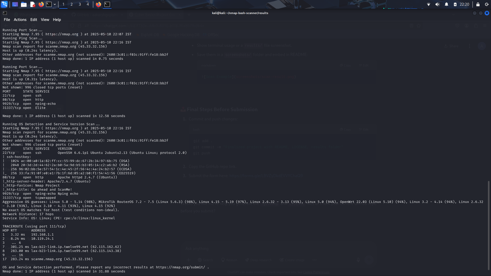

# 🔍 Automated Network Reconnaissance using Nmap and Bash

## 📌 Overview

This project is a simple, beginner-friendly tool that automates the process of network reconnaissance using Nmap through Bash scripting. It helps in identifying live hosts, open ports, operating systems, and running services on a target system.

It was developed as part of the **Cyber Basics - Hack Me If You Can Bootcamp** organized by **DevTown** in association with the **Microsoft Student Chapter - MSIT**.

---

## 🎯 Objectives

- Understand and use Nmap for basic network scans.
- Automate reconnaissance with Bash scripting.
- Store scan results in organized output files.
- Host the project on GitHub with proper documentation.

---

## ⚙️ Features

- Accepts a target IP address or domain name.
- Performs:
  - Ping scan
  - Full port scan
  - OS and service version detection
- Saves all scan results to a text file inside a `results/` folder.

---

## 🛠️ Tools & Technologies

- **Nmap** – for scanning networks.
- **Bash (Linux Shell Scripting)** – to automate scanning.
- **GitHub** – for version control and hosting the code.

---

## 🧪 How to Use

### 1. Clone the Repository
```bash
git clone https://github.com/YOUR_USERNAME/nmap-bash-scanner.git
cd nmap-bash-scanner
```
### 2. Make the Script Executable
``` bash
chmod +x scan.sh
```
### 3. Run the Script
```bash
./scan.sh
```

### 4. Enter a Target
Example:
```yaml
Enter the target IP or domain: scanme.nmap.org
```
### 5. View Results
Output will be saved in the results/ folder as:

```bash
results/scanme.nmap.org_scan.txt
```

### Here is a test run:

